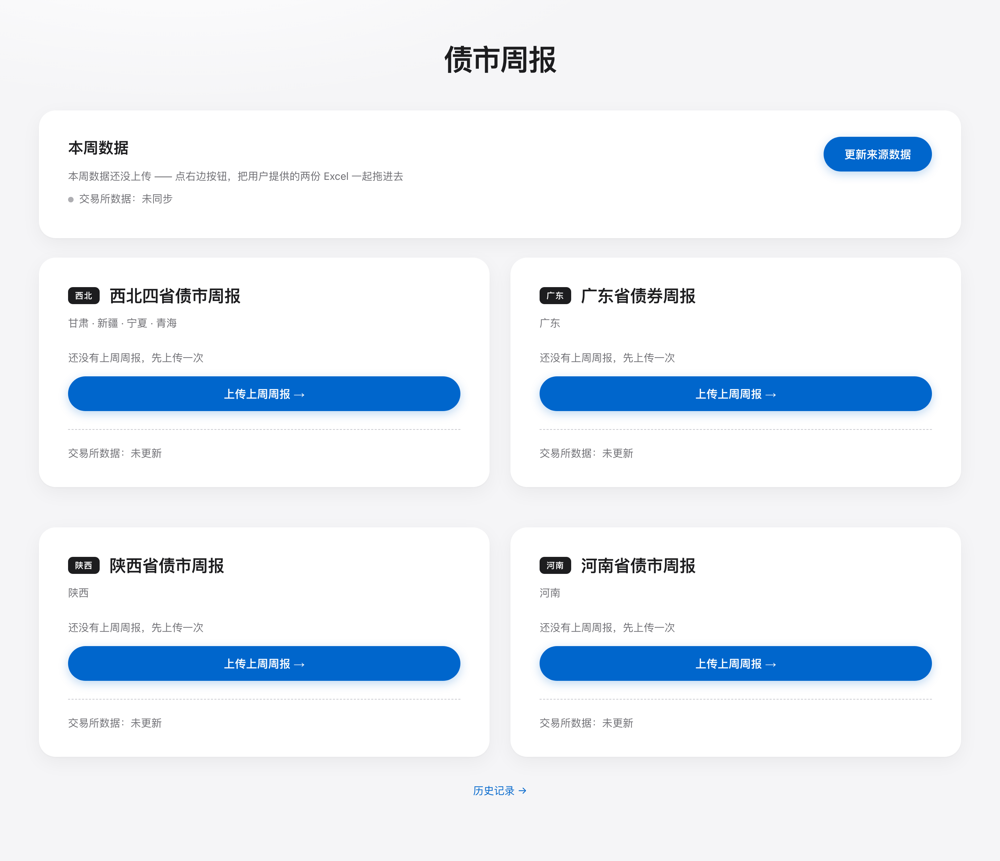
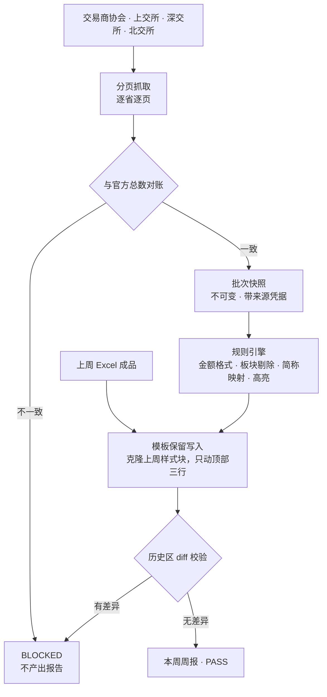

# Bond Weekly Automation

## 债券市场周报自动化生成

> A local pipeline for generating regional bond market weekly reports: it captures
> the official trading-association and exchange disclosures with full pagination
> reconciliation, freezes each complete batch as a verifiable snapshot, applies
> auditable per-region rules, and writes the new week into last week's own Excel
> template without touching historical rows.


## 界面



> 截图使用虚构/合成数据，仅用于展示程序界面，不包含任何真实业务材料。

每周要跑一份地区债市周报，动作是固定的：从**交易商协会、上交所、深交所、北交所**四个官方渠道
逐省逐页取数 → 按地区口径清洗 → 按业务规则调整格式 → 插进**上周那份 Excel 成品的最上面三行**，
历史区域一个格子都不能动。

人工做这件事的代价在于：漏一页就少一只债；格式规则散在脑子里，换个人就对不上；
Excel 是"复制上一周再改文字"改出来的，脚本一重写字体边框全丢；
更麻烦的是**出错了说不清是哪一步错的**。

本工作台把这条链路固定成：**官方抓取 → 完整性对账 → 批次快照 → 规则引擎 → 模板保留写入 → 历史区 diff 校验**，
并且给出结构化的 `PASS / WARNING / BLOCKED` 结论 —— 数据不可信时**直接拒绝出报告**，而不是产出一份看起来正常的文件。


## 核心能力

| 能力 | 说明 |
|---|---|
| **多源官方采集** | 交易商协会、上交所、深交所、北交所四路抓取，纯 HTTP 实现，不依赖浏览器或 Selenium |
| **抓取完整性对账** | 一批数据只有在**每个省份、每一页都与官方总数对上**之后才算抓取成功，凭据随数据一起传递 |
| **批次快照与回放** | 完整批次固化为可校验快照；历史批次原样保留并标记为未验证，回放前先整体校验而不是拿旧批次掩盖新失败 |
| **可审计的业务规则** | 各所金额格式、ABS/公募 REITs 剔除、承销商简称映射与冲突阻断、高亮规则，逐条编号成文并有测试覆盖 |
| **模板保留写入** | 直接做 xlsx 的 OOXML 变换并克隆上一周的样式块，**不用 openpyxl 重写**（会丢 XML 细节） |
| **历史区不可变** | 生成后强制 diff 校验：历史区域出现任何差异即判定失败，**不产出文件** |
| **结构化结论** | 一次运行返回 `PASS / WARNING / BLOCKED`、指标、警告、阻断原因与来源清单 |

## 处理流程



## 技术实现

| 层 | 实现 |
|---|---|
| 运行时 | Python 3.9+ |
| 数据采集 | 标准库 HTTP + `requests` + `html.parser`，直接解析官方接口响应与页面 |
| 核心引擎 | `generate_report(request, context) -> ReportResult` —— **无状态纯任务接口**，CLI / 双击脚本 / Web 三端都只是壳 |
| 快照层 | SQLite 保存批次凭据与原始响应原文，失败尝试也留档 |
| 规则层 | 业务规则集中在 `rules.py` 并逐条编号（R1–R7），改规则前必须先跑回归 |
| 模板层 | xlsx OOXML 字符串级变换 + 追加 sharedStrings，保留人工编辑产生的一切格式 |
| 服务层 | FastAPI，默认只监听 `127.0.0.1` |
| 测试 | 标准库 `unittest` |

## 测试与质量基线

```bash
python -m unittest discover -s tests -v
```

```
Ran 7 tests in 0.192s — OK
```

覆盖：金额格式规则、简称映射加载、**交易商协会未知状态必须 BLOCKED**、
默认不预置任何特定承销商优先、Web 默认只监听本机、空数据库可初始化、快照往返校验。

## 快速开始

```bash
python3 -m venv .venv && source .venv/bin/activate
pip install -r requirements.txt
```

Web 工作流：

```bash
uvicorn app.web.app:app --host 127.0.0.1 --port 8000
# 或双击 start_web.command
```

命令行生成：

```bash
python3 weekly.py                    # 全自动：取最新模板与数据
python3 weekly.py --replay-cutoff "2026-08-15 23:59:59"   # 用快照重放某一期
```

## 地区配置化（Part Profile）

一个 **Part** = 地区范围 + 业务规则 + 格式策略，全部写在 `app/core/parts.yaml`。
新增地区只需加一段配置，**视觉格式永远从"上一周成品"继承，不在这里写死**。

仓库内公开了四个地区 Profile 作为结构示例：`northwest`（西北四省）、`guangdong`（广东）、
`shaanxi`（陕西）、`henan`（河南）。

## 项目结构

```
weekly.py                 命令行薄壳
app/core/
  engine.py               无状态核心：generate_report()
  exchange_fetch.py       四个官方渠道的抓取与完整性对账
  snapshot.py             批次快照与回放校验
  rules.py                业务规则（R1–R7）
  template_engine.py      模板保留写入 + 历史区 diff 校验
  capture_store.py        原始响应留档
  parts.yaml              地区 Profile 配置
app/web/                  FastAPI 服务与 Web 工作流
tests/                    回归测试
tools/public_release_check.py   公开版脱敏自检
```

## 数据安全

本仓库为**公开展示版本**，仅包含通用代码、算法实现与回归测试。
实际业务中的数据库、历史抓取快照、生产模板、真实输入数据与输出报告均不包含在仓库中，
相关目录已由 `.gitignore` 排除（`data/`、`jobs/`、`output/`、`shared/` 只保留占位文件）。
`input/简称.xlsx` 为虚构示例映射，可替换为自己的映射表。

公开版未预置任何特定券商的优先排序、高亮机构、法人简称例外或内部文件号映射；
需要这些行为时通过配置或环境变量自行设置。正式部署版本与本公开仓库分开维护。

## 许可

本仓库当前未附开源许可证。公开可见不等于自动获得复制、修改与再分发许可。
如需复用，请先联系作者确认授权。
