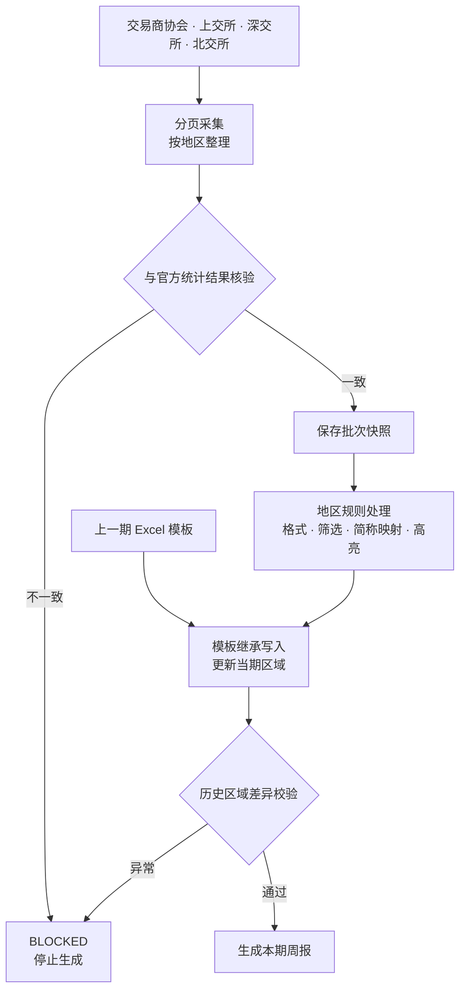

# Bond Weekly Automation

## 债券市场周报自动化生成

> A local pipeline for collecting public bond-market data, validating completeness and generating regional weekly reports from an existing Excel template.

## 界面


> 截图使用虚构/合成数据，仅用于展示程序界面，不包含任何真实业务材料。

该工具用于地区债券市场周报的周期性生成。程序从**交易商协会、上交所、深交所和北交所**获取公开信息，对分页结果与官方总数进行完整性核验，再按照地区配置和业务规则整理数据，并写入上一期 Excel 模板。生成完成后会对历史区域进行差异校验；当数据完整性或模板校验未通过时，流程停止并返回阻断原因。

## 核心能力

| 能力 | 说明 |
|---|---|
| **多源数据采集** | 从交易商协会、上交所、深交所和北交所获取公开数据 |
| **完整性核验** | 对分页结果、地区汇总数和官方总数进行一致性检查 |
| **批次快照与回放** | 对完整批次保存可校验快照，用于复核和历史重放 |
| **规则集中管理** | 金额格式、板块筛选、简称映射和高亮规则集中维护并纳入测试 |
| **模板继承写入** | 直接在 xlsx 的 OOXML 层更新新一期区域，保留上一期模板中的既有格式和结构 |
| **历史区域保护** | 生成后对历史区域执行差异校验，检测到非预期修改时停止输出 |
| **结构化运行结果** | 返回 `PASS / WARNING / BLOCKED`、告警信息、阻断原因和来源记录 |

## 处理流程



## 技术实现

| 层 | 实现 |
|---|---|
| 运行时 | Python 3.9+ |
| 数据采集 | 标准库 HTTP、`requests` 与 `html.parser`，根据不同来源解析接口响应或页面 |
| 核心引擎 | `generate_report(request, context) -> ReportResult`，CLI、双击脚本和 Web 共用同一核心接口 |
| 快照层 | SQLite 保存批次校验信息和原始响应，失败尝试亦可留档 |
| 规则层 | 业务规则集中在 `rules.py` 并按编号维护 |
| 模板层 | 直接在 xlsx OOXML 层进行更新，保留模板已有格式与结构 |
| 服务层 | FastAPI，默认仅监听 `127.0.0.1` |
| 测试 | 标准库 `unittest` |

## 测试与质量基线

```bash
python -m unittest discover -s tests -v
```

```text
Ran 7 tests — OK
```

测试覆盖金额格式、简称映射、未知数据状态阻断、默认配置、Web 监听地址、空数据库初始化和快照往返校验等关键规则。

## 快速开始

```bash
python3 -m venv .venv
source .venv/bin/activate
pip install -r requirements.txt
```

Web 工作流：

```bash
uvicorn app.web.app:app --host 127.0.0.1 --port 8000
```

也可双击 `start_web.command`。

命令行：

```bash
python3 weekly.py
python3 weekly.py --replay-cutoff "2026-08-15 23:59:59"
```

## 地区配置

地区范围、业务规则和格式策略统一配置在 `app/core/parts.yaml`。新增地区通过新增配置完成，模板视觉格式继续从上一期成品继承。

公开版包含 `northwest`、`guangdong`、`shaanxi`、`henan` 四个地区 Profile，作为配置结构示例。

## 项目结构

```text
weekly.py                       命令行入口
app/core/
  engine.py                     核心生成接口
  exchange_fetch.py             多来源采集与完整性核验
  snapshot.py                   批次快照与回放
  rules.py                      业务规则
  template_engine.py            模板写入与历史区域校验
  capture_store.py              原始响应留档
  parts.yaml                    地区配置
app/web/                        Web 工作流
tests/                          回归测试
tools/public_release_check.py   公开版脱敏检查
```

## 数据安全

本仓库为公开展示版本，仅包含通用代码、配置结构和回归测试。实际业务中的数据库、历史抓取快照、生产模板、真实输入数据和输出报告不进入版本库。`input/简称.xlsx` 为虚构示例映射，可替换为自有映射表。

## 许可

本仓库当前未附开源许可证。公开可见不代表自动授予复制、修改或再分发权限；如需复用，请先联系作者确认授权。
