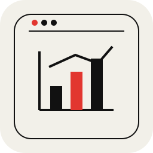
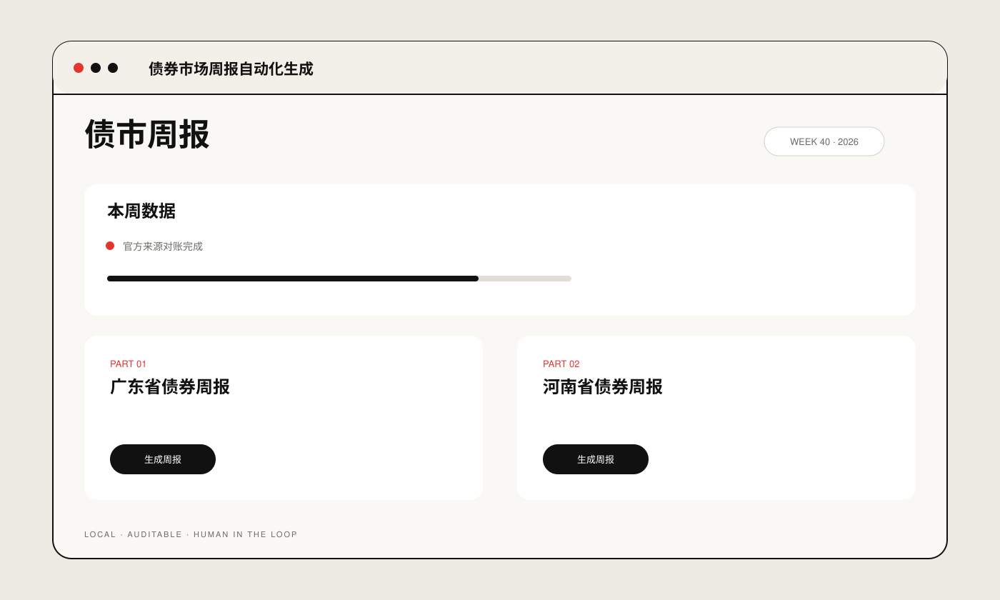

# Bond Weekly Automation

**债券市场周报自动化生成**

An automation system for bond market data processing and template-based weekly report generation.

## Preview

Interface overview is a schematic preview based on the current UI structure, not a screenshot. No real business materials are shown.

**Engineering:** four-source reconciliation · replayable snapshots · historical-region diff guard

## Validation

`7 tests passed` · data-quality failures block report generation

## Run locally

- macOS: `./start_web.command`
- CLI: `python weekly.py`

Public portfolio edition. No real client documents, production data or internal materials are included.

[Technical notes →](docs/technical-notes.md)
